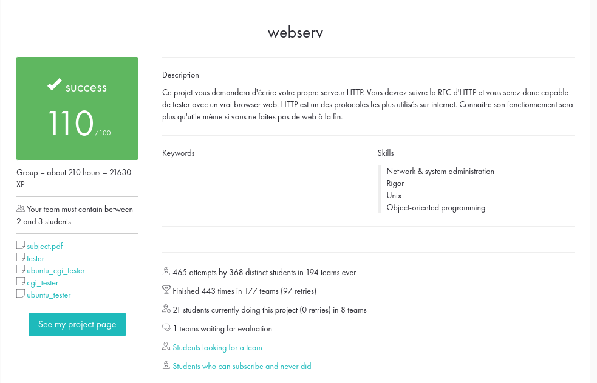
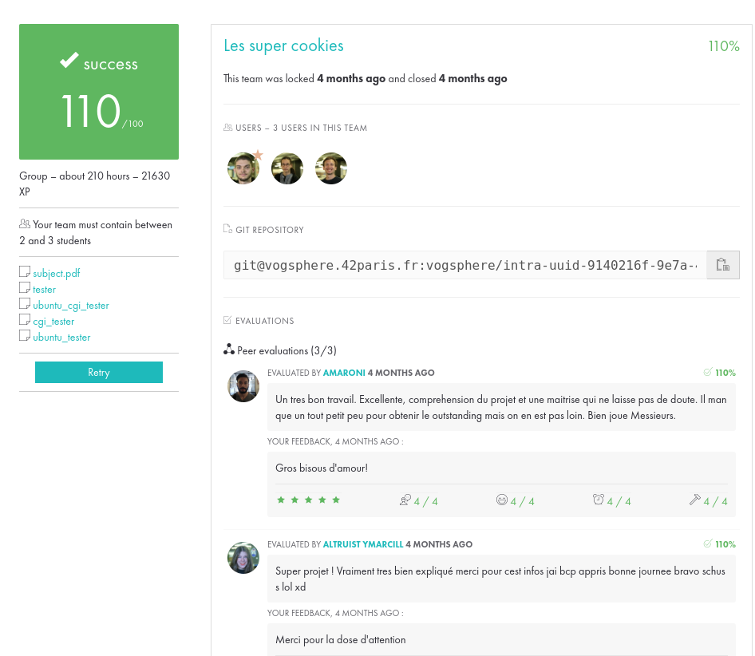

# webserv

webserv project at 42 school

This project was created by three students at school 42 in Paris.

I am not allowed to share the subject as it is the property of school 42.

## How to run

To run normally, run `make` and start `./webserv` with a config file provided in
`./config_files/`, there is a shortcut to this: `make run`
To run in test mode, run `make --eval="CFLAGS += -D TEST" && ./webserv`

## Results

This is the project page:

And this is the results:

